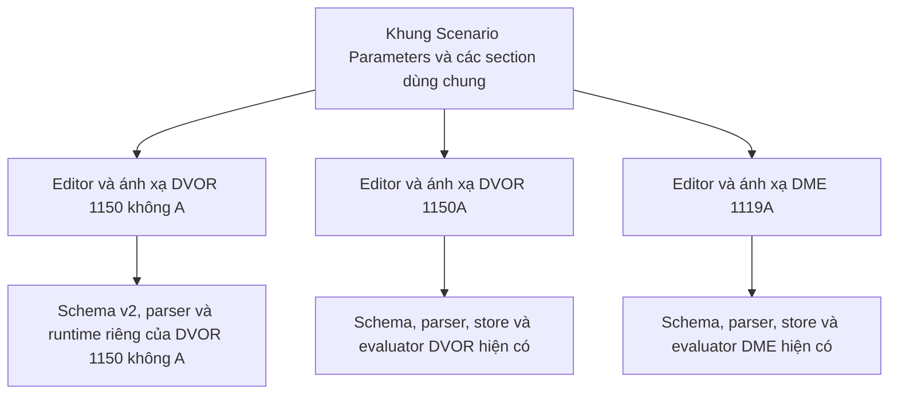

# Kế hoạch thống nhất cách tổ chức Scenario Parameters cho ba thiết bị SELEX PMDT

**Ngày lập:** 01/10/2026

**Phiên bản:** 1.1 — bổ sung DVOR 1150 không A theo yêu cầu người dùng

**Phạm vi đã duyệt:** DVOR 1150 không A, DVOR 1150A và DME 1119A

**Trạng thái:** IN PROGRESS — D01–D06 và giao diện dev đã được duyệt; gate G6 đạt, chuẩn bị commit/push và xác minh release G7

**Phương án đề xuất:** Dùng chung cấu trúc biểu mẫu và thuật ngữ; giữ dữ liệu, tham số và bộ đánh giá riêng của từng thiết bị.

### Cập nhật phạm vi ngày 01/10/2026

- Người dùng yêu cầu đưa DVOR 1150 không A vào cùng đợt vì cả ba sử dụng PMDT của SELEX.
- DVOR 1150 không A chuyển từ phần mở rộng sang phạm vi triển khai chính; bổ sung task, test, tài liệu và nghiệm thu cho thiết bị này.
- Khảo sát xác nhận non-A đang dùng schema v2, hỗ trợ import v1 và chỉ có whitelist quyền sửa. Để có cùng lựa chọn Open/Restricted, đề xuất bổ sung `editPolicy?` cho non-A qua một giai đoạn logic riêng, có quyết định D06 chờ duyệt. Quyền của dữ liệu cũ được giữ nguyên.

### Cập nhật triển khai sau phê duyệt “duyệt”

- Đã viết section/presenter/policy controls chung và áp dụng bố cục 5 nhóm trên cả ba panel. Metadata/preset ở đầu, cấu hình ban đầu trong nhóm 1, preview/footer ở cuối.
- Non-A: thêm optional policy vào schema v2; nối resolver vào setter, Apply, protected-field check, `Dvor1150ConfigControl` và `Dvor1150SimulationParametersPanel`. Factory/preset vẫn thiếu policy như trước, giữ whitelist; parser v1→v2 giữ cách suy ra whitelist hiện có.
- Quyền Open/Restricted dùng helper draft chung để giữ danh sách explicit khi khác legacy và khi chuyển qua Open. Không thay thuật toán vật lý/diagnosis.
- Hai panel 1150A/DME lấy evidence cho kết quả active như HUD hiện có. Non-A giữ evidence active có sẵn; preview baseline được giải thích riêng và không gắn nhãn hoàn thành chẩn đoán.
- Bảng ownership: 1150A chuyển field `.faults.*` vào nhóm 2; non-A chuyển công suất/reference/SBO nominal, output/sideband RF scale và nhiệt độ TX vào nhóm 2; DME giữ mảng fault. Mọi field cấu hình còn lại ở nhóm 1; mỗi field chỉ có một editor giá trị.
- Fixture đã chọn từ contract/tests hiện có: default/legacy không diagnosis, non-A Low Carrier/9960 và CSB TX1/TX2, 1150A Synthesizer TX2, DME Delay/HPA; parser v1/v2 và policy rỗng/explicit/Open cần kiểm tra tại G6. Chưa chạy baseline/tests sau chỉnh sửa.
- Dev Node 24 chạy tại `http://127.0.0.1:3000`; ba simulator trả HTTP 307 về login khi chưa đăng nhập. Browser inventory rỗng và IAB trả `Browser is not available: iab`, nên browser QA/ảnh chụp thật chưa có. Không dựng UI giả hoặc bỏ guard đăng nhập để thay thế QA.
- Hướng dẫn chung đã viết tại `docs/simulators/selex-scenario-parameters.md`; đã cập nhật hướng dẫn 1150A và README. Chờ người dùng mở bản dev, xem UI và xác nhận trước tests/typecheck/build/push theo G5 và skill PMDT.

### Cập nhật — đăng nhập local cho lượt review

- Người dùng báo lỗi đăng nhập; log xác nhận chưa cấu hình DATABASE_URL. Đã tạo PostgreSQL 17.11/database `cns_selex_preview` cục bộ, loopback port 5433, áp dụng đủ 13 migration và bổ sung cấu hình vào `.env.local` được ignore.
- Đã khởi tạo admin local, xác minh hash với lần nhập cục bộ của người dùng; mật khẩu không được in/ghi vào source. Tắt Server Function argument logging ở `next.config.ts`, xử lý log cũ và restart dev.
- Health báo database OK; login action thật với fixture tạm thời trả SUCCESS/session cookie. Cả ba route với phiên xác thực trả 200 và render authoring toolbar; đã dọn fixture.
- Giới hạn: kiểm chứng bằng HTTP/action/SSR, không có browser screenshot hoặc user UI approval. Tiếp tục G5; không coi các gate G6/G7 đã hoàn tất.

### Cập nhật — duyệt UI và kiểm tra trước commit/push

- Người dùng xác nhận giao diện tiếng Việt trên bản dev phù hợp và yêu cầu “commit push đi”. Đây là phê duyệt UI và phát hành; không cần hỏi lại.
- Node 24.18.0: `npm run lint`, `npm run typecheck`, focused Vitest **16 file / 113 test** và `npm run build` **84/84** đều đạt. Không sửa navigation/AppShell/MOPIENS/test setup, nên local gate dùng test trực tiếp; CI vẫn chạy toàn suite.
- Đã thêm 12 test cho policy draft, non-A parser/guard/Apply/Restore, ba panel giữ dữ liệu native qua policy round-trip và evaluator dùng policy snapshot. Hai lượt đầu thất bại do fixture chưa bật authoring và fixture 1150A legacy không có diagnosis; sửa đúng fixture sang Synthesizer TX2, chạy lại focused gate đạt, không thay guard để làm test xanh.
- User review xác nhận UI dev; không có ảnh/browser automation của agent để kết luận đã kiểm tra mọi kích thước hoặc toàn workflow production. Các task browser sâu chưa đánh dấu hoàn tất.
- Gói Git gồm source, test và tài liệu; config/DB/log/script local được ignore. Không cần migration production cho optional policy. Bản phát hành này là mốc tối thiểu hỗ trợ explicit policy non-A; nếu bài Open đã được lưu/giao, rollback giữ parser/resolver.
- Trước push: `HEAD` bằng `deploy/main`; Oracle đang chạy service `cns-simulator-web-gpmry6` với checkout `49f4505b3af108256e08b886ad84df55de210b64`. Commit mới và CI/Dokploy/health được kiểm tra sau push và báo kết quả cuối lượt.

## 1. Mục tiêu và kết quả cần đạt

Giám khảo soạn kịch bản cho ba thiết bị SELEX PMDT theo cùng một trình tự và hiểu rõ:

1. Thiết bị bắt đầu ở trạng thái nào.
2. Người soạn đưa lỗi nào vào bài.
3. Kết quả vận hành nào cần đạt.
4. Bài có yêu cầu kiểm tra PMDT và xác định phần cứng hay không.
5. Thí sinh được phép sửa những trường nào.

Điều kiện đạt, thao tác bắt buộc và quyền sửa phải được giải thích riêng. Một trường được phép sửa không tự trở thành thao tác bắt buộc. Thay đổi bố cục không được làm đổi kết quả đánh giá của kịch bản đã lưu.

Kết quả đợt đầu: ba cửa sổ Scenario Parameters có cùng thứ tự nhóm, tên nhóm, cách hướng dẫn, vị trí xem trước và nút điều khiển; vẫn hỗ trợ đầy đủ dữ liệu riêng của mỗi thiết bị. Cùng PMDT là căn cứ để chia sẻ phần trình bày; điều kiện kỹ thuật, menu/view ID, bộ chấm và mã card được đối chiếu theo model cụ thể.

## 2. Hiện trạng đã khảo sát

Khảo sát này dựa trên source tại checkout hiện tại, chưa kiểm tra UI production hoặc database production. CodeGraph báo index mới; nhánh `main`. Khi mở rộng kế hoạch, chỉ tài liệu này đang là file mới chưa commit; không có thay đổi source.

| Nội dung | DVOR 1150 không A | DVOR 1150A | DME 1119A | Hệ quả |
| --- | --- | --- | --- | --- |
| Component chính | `src/components/dvor1150/pmdt-scenario-parameters.tsx` | `src/components/vor/dvor1150a-scenario-parameters.tsx` | `src/components/dme/dme-scenario-parameters.tsx` | Ba biểu mẫu JSX đang được tổ chức riêng |
| Dữ liệu kịch bản | `Dvor1150ScenarioDefinition`, schema v2; parser nhận v1 và chuẩn hóa sang v2 | `Dvor1150aScenarioDefinition`, schema v1 | `Dme1119aScenarioDefinition`, schema v1 | Giữ version theo thiết bị; không ép cả ba về một schema |
| Trạng thái ban đầu | TX chính, Local, Integral Monitor Bypass | TX chính, Local, Integral Monitor Bypass | TX chính, Local, Integral/Standby Bypass, Ident mode | Cùng nhóm nhưng khác số trường |
| Điều kiện đạt | 4 boolean; có `requireNoVswrExecutiveAlarm` | 4 boolean; có `requireNoSidebandVswrAlarm` | Mảng criterion có ID, loại và tham số | Hai loại tiêu chí VSWR không được đồng nhất ý nghĩa chỉ vì cùng có 4 checkbox |
| Lỗi đưa vào | Các giá trị configuration tạo triệu chứng theo preset; chưa có mảng fault riêng | Một phần nằm trong `configuration.transmitters.*.faults` và các giá trị gây triệu chứng | Mảng `faultInjections` có editor riêng, cùng baseline cấu hình | Nhóm Lỗi cần editor/ánh xạ theo model |
| Chẩn đoán hai bước | Có `diagnosis?`, view/action/hardware occurrence riêng | Có `diagnosis?` | Có `diagnosis?` | Cả ba cùng dùng presenter nhưng giữ catalog riêng |
| Biên tập chẩn đoán | Khối thông tin đọc từ preset/JSON | Tương tự | Tương tự | Đợt đầu thống nhất khối hiển thị; editor đầy đủ là mở rộng |
| Quyền sửa hiện tại | `studentEditableFieldIds`; guard `setConfigValue`, Apply và protected-field comparison đọc trực tiếp whitelist | `editPolicy?` và danh sách legacy | `editPolicy?` và danh sách legacy | Open cho non-A cần bổ sung logic, không thể chỉ thêm select vào JSX |
| Mục tiêu thao tác | Chưa có `taskTargets?`; có checkpoint/lệnh trong diagnosis | Có `taskTargets?` | Có `taskTargets?` | Giữ contract theo model; không tự bổ sung taskTargets cho non-A |
| Đánh giá kết quả | Nhánh legacy khi không có evidence; panel active đã truyền evidence, preview không truyền | Áp dụng diagnosis khi có định nghĩa; panel authoring không truyền evidence | Nhánh legacy khi không truyền evidence | Giữ phân biệt preview và bài làm; không đổi quy trình chẩn đoán để đồng nhất UI |

### 2.1. Điểm cần giải thích đúng trong giao diện

- Với bài chỉ đánh giá vận hành: điều kiện vận hành quyết định việc xử lý thành công.
- Với `diagnosis.disposition = software-adjustment`: evaluator kiểm tra bằng chứng PMDT/thao tác, phục hồi vận hành và xác nhận không thay phần cứng.
- Với `diagnosis.disposition = replace-module`: nhánh chẩn đoán hiện tại có thể hoàn thành PMDT và nhận diện card khi baseline chưa về Normal. Không hiển thị lời hướng dẫn rằng mọi bài thay card bắt buộc phải hết cảnh báo.
- DVOR 1150A áp dụng diagnosis khi có định nghĩa; DVOR 1150 không A và DME 1119A có nhánh legacy khi evaluator không nhận evidence. Panel non-A đã truyền evidence cho phiên active và không truyền cho preview; hai panel còn lại có lời gọi authoring không truyền evidence. Kế hoạch phải giữ wiring đúng ngữ cảnh, phân biệt xem trước baseline với kết quả bài làm.
- `diagnosticResult`, `expectedHardware` và tài liệu đáp án là nội dung cho người soạn/giám khảo. Việc tái sử dụng component không được làm chúng xuất hiện trong giao diện thí sinh.
- DVOR 1150 không A cần giữ trình tự PMDT → chẩn đoán → chọn đúng occurrence card/block → kết thúc, gồm phân biệt TX1/TX2, Monitor 1/2 và các nhánh sideband. Không lấy mã/assembly của 1150A để chấm non-A.

### 2.2. Chênh lệch policy của DVOR 1150 không A và phần bổ sung đề xuất

Để nhóm Quyền chỉnh sửa có cùng hai chế độ trên cả ba thiết bị, đề xuất bổ sung có giới hạn cho non-A:

1. Thêm `editPolicy?: ScenarioEditPolicy` vào định nghĩa non-A; giữ schema v2 hiện có nếu kiểm tra parser/storage xác nhận mở rộng optional tương thích. Không cần thay schema v1 của hai thiết bị còn lại.
2. Định nghĩa resolver phân loại field non-A; dùng chung primitives `isScenarioFieldAllowed`, `scenarioAllowedFieldIds` và `validateScenarioEditPolicy`. Chốt field được phép theo catalog và vai trò; không mở tất cả field bằng cách dựa vào tên nhóm.
3. Mọi definition không có policy tiếp tục dùng whitelist hiện có. Import v1 vẫn chạy `inferLegacyStudentEditableFieldIds` như hiện tại rồi áp dụng semantics Restricted; không tự mở rộng quyền.
4. `setConfigValue`, Apply và protected-field comparison phải dùng cùng resolver. Giữ guard security/Local và guard riêng của các lệnh; Reset/Restore trong scenario vẫn trả về baseline theo thiết kế non-A.
5. Open chỉ được chọn chủ động cho non-A. Preset, JSON cũ và snapshot đã giao giữ quyền Restricted tương đương hiện tại; không thay mặc định hoặc backfill hàng loạt.
6. Khi chỉ đổi bố cục, kết quả bài cũ không thay đổi. Khi người soạn chọn policy mới, đó là thay đổi nghiệp vụ rõ ràng và phải theo cơ chế lưu revision hiện có, không sửa snapshot của lượt thi đang chạy.

Đây là phạm vi logic mới so với bản kế hoạch hai thiết bị, cần duyệt D06 trước khi thực hiện G3. Nếu người dùng chọn chỉ thống nhất tổ chức UI, nhóm 5 của non-A thể hiện Restricted thật sự và danh sách field hiện có; Open không được hiển thị như một tính năng đã hoạt động.

### 2.3. Quan hệ với kế hoạch đang có

Đọc cùng `plans/refactor/2026-09-30-scenario-code-exam-unified-implementation-plan.md`. Tài liệu đó đang triển khai luồng kỳ thi bằng mã, runtime từ snapshot, bằng chứng và review.

Kế hoạch này là phần việc tổ chức biểu mẫu authoring. Không thay thế kế hoạch kỳ thi, không đổi định danh item/revision, không xử lý thay các phần còn lại như restore checkpoint server hoặc finalize timeout.

## 3. Lựa chọn phương án

| Phương án | Ưu điểm | Chi phí/rủi ro | Đề xuất |
| --- | --- | --- | --- |
| A. Chung bố cục, section và presenter; editor/dữ liệu riêng theo thiết bị; bổ sung policy non-A có giới hạn | Bảo toàn dữ liệu cũ; thay từng thiết bị được; có cùng Open/Restricted khi D06 được duyệt | Cần ba phần ánh xạ typed, resolver non-A và kiểm tra round-trip/guard | Chọn cho đợt đầu, với D06 được duyệt rõ |
| B. Hợp nhất schema, criterion, fault và evaluator | Có thể xây editor tổng quát hơn | Migration, parser, preset, snapshot đề thi và đánh giá bị ảnh hưởng rộng | Chỉ xem xét khi có yêu cầu nghiệp vụ riêng và kế hoạch migration được duyệt |

Phương án A chỉ chia sẻ phần thật sự chung. Không tạo framework plugin mới, không thay Zustand store bằng store tổng quát.

## 4. Cấu trúc giao diện thống nhất

Thông tin nhận dạng và công cụ preset/import/export nằm ở đầu. Năm nhóm nghiệp vụ đặt theo thứ tự sau:

| Thứ tự | Tên nhóm đề xuất | Nội dung | Hướng dẫn ngắn tại nhóm |
| --- | --- | --- | --- |
| Đầu cửa sổ | Thông tin kịch bản | ID, tên, độ khó, mô tả; Preset, Import/Export | Dữ liệu đang soạn là bản nháp, chưa áp dụng vào phiên |
| 1 | Trạng thái khởi đầu — Initial state | TX chính, Local, Bypass, Ident nếu có; Cấu hình ban đầu theo nhóm thiết bị | Thiết bị bắt đầu bài với các trạng thái và giá trị này |
| 2 | Lỗi đưa vào — Fault injection | Fault editor DME; fault native DVOR 1150A; tham số gây triệu chứng/preset non-A | Người soạn tạo lỗi/triệu chứng để thí sinh kiểm tra |
| 3 | Điều kiện đạt — Success criteria | Điều kiện vận hành được thiết bị hỗ trợ | Đây là kết quả cần đạt; không tự quy định những trường phải sửa |
| 4 | Chẩn đoán hai bước — Diagnostic workflow | PMDT/checkpoint → xác định phần cứng hoặc xác nhận không thay | Đáp án chẩn đoán và yêu cầu bằng chứng của kịch bản |
| 5 | Quyền chỉnh sửa của thí sinh — Student edit policy | Open/Restricted, các trường được phép sửa theo nhóm | Quyền sửa độc lập với điều kiện đạt và thao tác bắt buộc |
| Cuối phần nội dung | Xem trước trạng thái khởi đầu — Initial preview | TX, monitor, thông số nổi bật, lỗi kiểm tra bản nháp | Xem trước không phải kết quả bài làm đã hoàn thành |
| Chân cửa sổ | Điều khiển phiên | Apply Scenario, Restore Scenario, End / Restore TST, Close | Mỗi nút dùng action hiện có của thiết bị |

### 4.1. Ngôn ngữ và hình thức

- Đề xuất tên nhóm bằng tiếng Việt, kèm thuật ngữ tiếng Anh để dễ đối chiếu. Giữ tên menu PMDT, mã card, assembly ID, đơn vị đo và enum lưu trong dữ liệu.
- Giữ phong cách PMDT cổ điển, bề mặt xám, bảng gọn và mật độ thông tin cao.
- Dùng một cột trong cửa sổ, section có heading và lời giải thích ngắn. Nhóm tham số dài có thể thu gọn; lỗi ở nhóm nào phải được tìm thấy trong nhóm đó.
- Thông tin bản nháp/phiên active ở đầu; nút hành động ở chân cửa sổ. Nội dung dài cuộn trong cửa sổ, không che footer.
- Giữ keyboard focus-visible, nhãn cho input/checkbox, disabled/loading và vùng bấm đủ dùng. Không thêm animation hoặc bộ theme mới.
- Cửa sổ trên màn hình nhỏ phải vẫn truy cập được nút đóng, lỗi và footer. QA ít nhất 1366×768, 1920×1080 và vùng hiển thị hẹp khoảng 768 px; không redesign toàn bộ PMDT mobile.

### 4.2. Trạng thái khởi đầu và lỗi

- Tách checkbox điều kiện đạt khỏi `Start policy` của cả DVOR 1150 không A và 1150A.
- Đưa `Scenario configuration` vào mục Cấu hình ban đầu thuộc nhóm 1; giữ các phân nhóm Station/Transmitter/Monitor/RMS của từng thiết bị.
- Phân nhóm các trường fault DVOR 1150A hiện có sang nhóm 2 bằng danh sách field ID/capability đã khảo sát. Với non-A, nhóm 2 thể hiện các tham số gây triệu chứng/preset native và vị trí biên tập duy nhất; không tự dựng mảng fault hoặc fault flag mới. Các giá trị như offset/scale không mặc nhiên trở thành fault flag.
- Một field chỉ có một nơi biên tập giá trị trong cấu hình ban đầu/lỗi. Danh sách quyền sửa là nơi chọn quyền, không phải một editor giá trị thứ hai.
- DME giữ thao tác thêm/xóa fault và các loại fault hiện có. DVOR không được hiện nút thêm fault tùy ý khi schema chưa hỗ trợ.
- Không ghi cấu hình kịch bản vào profile cá nhân. Không tự đổi cấu hình live khi chỉ sửa bản nháp.

### 4.3. Điều kiện đạt

- Dùng cùng khung, lời hướng dẫn và cách nhóm các điều kiện vận hành.
- Mỗi DVOR hiển thị 4 tiêu chí native với nhãn rõ nghĩa và bật/tắt; giữ ánh xạ nguyên vẹn sang boolean của đúng model. Nhãn VSWR phải phân biệt executive alarm của non-A với sideband VSWR alarm của 1150A.
- DME giữ danh sách criterion, tham số riêng như monitor/expected transmitter và nút thêm/xóa. Chỉ cho chọn criterion được DME hỗ trợ.
- Không tự tạo ID criterion mới khi chỉ đổi bố cục; không đổi ý nghĩa `Any`, TX1/TX2, Integral/Standby/Both.
- Khi có diagnosis, hiển thị lời giải thích vai trò tiêu chí vận hành theo disposition hiện tại. Không đổi công thức SOLVED hoặc yêu cầu bài thay card để làm UI đồng nhất.

### 4.4. Khối chẩn đoán hai bước

Đợt đầu dùng presenter chung, vẫn đọc dữ liệu hiện có:

1. Triệu chứng/tóm tắt sự cố.
2. **Kết luận PMDT mong đợi** thay cho nhãn dễ nhầm `PMDT result`.
3. Hướng xử lý: thay module/card hoặc hiệu chỉnh phần mềm.
4. Kiểu chạy diagnostics: Full/On-air/Không yêu cầu.
5. Màn hình PMDT phải kiểm tra (`pmdtCheckpoints`).
6. Thao tác phải thực hiện (`requiredActionControlIds`), phân biệt mở màn hình với chạy lệnh được chấp nhận.
7. Đáp án phần cứng: thiết bị, block, vị trí/occurrence, assembly ID. Không chỉ dùng chuỗi `1A3A11` làm định danh chấm bài.
8. Căn cứ manual.

Nếu không có `diagnosis`, cùng vị trí nhóm 4 hiển thị: “Kịch bản này chưa cấu hình chẩn đoán hai bước”. Render không tự thêm diagnosis hoặc nâng bài cũ thành bài chẩn đoán.

`taskTargets` nếu có ở 1150A/DME được bảo toàn và hiển thị trong phần yêu cầu thao tác với nhãn kiểm tra/đã Apply rõ ràng. Non-A tiếp tục dùng checkpoint/lệnh trong diagnosis; không tự thêm schema taskTargets. Không tự thêm mục tiêu hoặc bổ sung cách chấm `taskTargets` trong đợt tổ chức UI.

Đáp án chỉ hiện trong authoring/giám khảo theo quyền hiện có. Presenter không tự truy cập store; nơi gọi component quyết định nội dung và quyền hiển thị.

### 4.5. Quyền sửa

- `Open`: mọi field nghiệp vụ an toàn được catalog/policy hiện có cho phép; không đồng nghĩa mọi tham số nội bộ.
- `Restricted`: chỉ các field được chọn rõ trong danh sách. Danh sách rỗng có thể hợp lệ cho bài chẩn đoán không yêu cầu sửa cấu hình.
- Dùng resolver hiện có của 1150A/DME và resolver non-A đề xuất ở mục 2.2 để thể hiện quyền thực sự. Field runtime/security/instructor-only/read-only không được bật bằng checkbox của UI mới. Trường phục vụ người soạn tạo triệu chứng phải được phân loại trước khi cho phép Open.
- Bảo toàn fallback `studentEditableFieldIds` cho JSON cũ thiếu `editPolicy`; không tự chuyển chúng thành Open.
- Khi đổi Open/Restricted, giữ danh sách explicit đã chọn để quay lại Restricted; không lấy tất cả checkbox hiển thị checked ở Open làm whitelist mới.
- Giữ điều kiện SEC3/SEC4, Local/Bypass, Apply/Backup/Restore và guard lệnh của từng thiết bị.
- Trong đợt đầu giữ chọn từng field và các nhóm hiện có. Tìm kiếm/chọn toàn nhóm, action policy và editor mục tiêu thao tác là mở rộng riêng.

## 5. Tổ chức code đề xuất

Tên file dưới đây là đề xuất, chưa phải file đã được tạo:

| Khu vực | Dự kiến thay đổi | Trách nhiệm |
| --- | --- | --- |
| `src/components/scenario/parameters/` | Component khung, section, diagnosis summary và edit-policy controls | Heading, help text, bố cục, khả năng truy cập; không gọi engine hoặc tự đọc store |
| `src/components/dvor1150/pmdt-scenario-parameters.tsx` | Cùng 5 nhóm, 4 boolean native, diagnosis/policy theo non-A | Giữ action, evidence active, preview, import v1/v2 và hardware occurrence của non-A |
| `src/components/vor/dvor1150a-scenario-parameters.tsx` | Sắp xếp lại các nhóm, đưa JSX chung sang component nhỏ, nhóm fault native | Đọc/ghi draft DVOR theo type; gọi actions và parser hiện có |
| `src/components/dme/dme-scenario-parameters.tsx` | Cùng cấu trúc; giữ FaultEditor/CriterionEditor theo thiết bị | Đọc/ghi draft DME; bảo toàn các loại criterion/fault |
| `src/styles/pmdt-classic.css`, `src/styles/dme-pmdt-classic.css`, `src/styles/dvor1150-pmdt.css` | Chỉ điều chỉnh CSS thuộc Scenario Parameters | Tránh selector chung làm đổi toàn bộ simulator |
| `src/lib/dvor1150/scenario.ts`, `src/lib/dvor1150/index.ts`, `src/stores/dvor1150-pmdt-store.ts` | Nếu D06 được duyệt: thêm optional policy, resolver, validation và nối guard/setter/Apply/protected-field check | Thay đổi logic có giới hạn; giữ công thức vật lý và điều kiện chẩn đoán |
| `src/lib/scenario-policy.ts`, domain scenario/config catalogs | Tái sử dụng primitives/resolver/parser; khảo sát capability của ba model | Giữ schema v1/v2 riêng; không hợp nhất bộ đánh giá |
| `docs/simulators/` | Cập nhật hướng dẫn 1150A; thêm hướng dẫn non-A, DME và tổ chức chung nếu cần | Mô tả đúng tên nhóm, ví dụ, schema/capability riêng và cách dùng |
| `README.md` | Nhật ký khi triển khai | Đã viết / đã xác minh / còn lại, gate và release |

Component shared nhận props typed và callback. Chỉ tạo phần ánh xạ riêng khi phải đổi dữ liệu native thành dữ liệu hiển thị; không serialize cả definition qua một schema chung.

Phần domain/store của non-A chỉ thuộc mục 2.2/G3 khi D06 được duyệt. Chạy `codegraph impact` cho symbol tương ứng trước khi sửa; việc thay resolver có thể ảnh hưởng cả blocker trong evaluator. Giữ thuật toán hoàn thành PMDT/hardware. Nếu phát sinh logic khác, ghi thêm task có lý do và phạm vi trước khi thực hiện.

## 6. Các giai đoạn và task

Độ phức tạp tương đối: **thấp** = chỉnh nhãn/bố cục; **vừa** = nhiều control/callback và giữ dữ liệu; **cao** = thay đổi quyền sửa hoặc hợp đồng dữ liệu/runtime. Các giai đoạn dưới đây chưa triển khai; G3 có phần logic policy cao hơn các bước bố cục.

### G0 — Khảo sát và chốt hợp đồng trước khi code

**Độ phức tạp:** vừa. **Phụ thuộc:** kế hoạch được duyệt.

- [x] G0.1 Lập bảng ánh xạ tất cả nhóm/field/control của ba thiết bị sang 5 nhóm mới; chỉ rõ nơi sở hữu từng field và capability riêng.
- [x] G0.2 Chốt nhãn song ngữ, trạng thái nhóm không có diagnosis và vai trò criteria theo disposition.
- [x] G0.3 Chọn fixture đại diện cho mỗi thiết bị: bài legacy không diagnosis; bài hiệu chỉnh; bài thay card; Restricted; thiếu editPolicy. Thêm Open cho 1150A/DME và fixture policy mới đề xuất cho non-A; riêng non-A có v1/v2 và trường hợp whitelist rỗng.
- [ ] G0.4 Ghi kết quả parse, policy, draft, preview và đánh giá fixture trước thay đổi; không chạy lại toàn bộ test chỉ để chụp baseline.
- [x] G0.5 Kiểm tra panel có thể thay cục bộ mà không sửa AppShell/navigation/MOPIENS/test setup; xác định gate áp dụng.
- [x] G0.6 Chốt D06 và bảng field-role non-A; kiểm tra parser/storage/revision chấp nhận optional policy; xác định tác động tới setConfigValue/Apply/blocker và rollback nếu có definition Open được lưu.

**Đầu ra:** bảng ánh xạ ba model và fixture có kết quả mong đợi. **Điều kiện qua:** mọi control/dữ liệu đang hỗ trợ đều có nơi sử dụng; phần policy non-A đã có quyết định rõ, không có yêu cầu đổi schema ẩn.

### G1 — Tạo phần trình bày dùng chung

**Độ phức tạp:** vừa. **Phụ thuộc:** G0.

- [x] G1.1 Tạo section chung có heading, help text, trạng thái rỗng và nội dung riêng.
- [x] G1.2 Tạo presenter diagnosis chung: kết luận mong đợi, checkpoint, lệnh, hướng xử lý, đáp án và manual.
- [x] G1.3 Tạo edit-policy controls dùng props/capability; dùng resolver của từng thiết bị cho quyền thực tế. Không thể hiện Open đã hoạt động trên non-A trước khi hoàn tất phần domain ở G3.
- [x] G1.4 Tạo vùng metadata, preview và footer có bố cục thống nhất; các handler vẫn do panel cung cấp.
- [x] G1.5 Giữ selector CSS trong phạm vi panel, focus-visible và bố cục cuộn.

**Đầu ra:** các component nhỏ dùng chung; simulator còn hoạt động. **Điều kiện qua:** không import store/engine cụ thể vào phần trình bày chung.

### G2 — Áp dụng cho DVOR 1150A

**Độ phức tạp:** vừa. **Phụ thuộc:** G1.

- [x] G2.1 Tách startPolicy khỏi successCriteria.
- [x] G2.2 Đưa cấu hình ban đầu vào nhóm 1; đưa field fault native vào nhóm 2, tránh editor giá trị trùng.
- [x] G2.3 Giữ 4 criterion native; thay nhãn sinh tự động từ camelCase bằng nhãn đọc được.
- [x] G2.4 Ánh xạ diagnosis, phần cứng theo hotspot/occurrence và mục tiêu thao tác hiện có vào presenter.
- [x] G2.5 Áp dụng nhóm quyền sửa, preview/footer; giữ Import/Export/Apply/Restore/End.
- [ ] G2.6 Xem trực tiếp bài Synthesizer TX2 `1A3A11` và bài hiệu chỉnh phần mềm; kiểm tra dữ liệu draft sau thao tác.

**Đầu ra:** DVOR có đủ 5 nhóm. **Điều kiện qua:** giá trị/draft/parser native không đổi ngoài field người soạn chủ động sửa.

### G3 — Áp dụng cho DVOR 1150 không A và nối policy

**Độ phức tạp:** vừa cho UI, cao cho quyền sửa/tương thích. **Phụ thuộc:** G0.6 + G1 + G2; phần Open/Restricted chỉ thực hiện khi D06 được duyệt.

- [x] G3.1 Sắp xếp panel non-A theo 5 nhóm; tách Starting state/Pass criteria; giữ riêng tiêu chí VSWR executive alarm.
- [x] G3.2 Khi D06 được duyệt: thêm optional editPolicy, resolver và validation; xử lý legacy thiếu policy bằng whitelist hiện có; giữ parser v1→v2 và mọi preset ở quyền tương đương hiện tại.
- [x] G3.3 Nối resolver vào setConfigValue, Apply và protected-field comparison; giữ guard SEC3/SEC4/Local, các lệnh PMDT và cơ chế Reset/Restore của non-A.
- [x] G3.4 Áp dụng shared policy controls sau khi domain hỗ trợ; Open là lựa chọn chủ động, không tự đổi policy của definition/snapshot cũ.
- [x] G3.5 Ánh xạ diagnosis/checkpoint/action/occurrence riêng; giữ evidence active và preview tách biệt, stage PMDT→hardware→complete cùng inspection/reasoning.
- [x] G3.6 Nhóm tham số tạo triệu chứng/preset trong Fault injection, giữ một nơi biên tập; không thêm mảng fault vào schema non-A.
- [ ] G3.7 Xem trực tiếp bài TX1 CSB amplifier `1A3`, bài TX2 tương ứng và bài Low Carrier/9960 Hz hiệu chỉnh; kiểm tra đúng occurrence thay vì chấp nhận card của 1150A.
- [x] G3.8 Ghi các kết quả cần regression: sideband/9960 Hz/RF, PreAlarm/voting, whitelist cũ, Apply/Reset/End và điểm đối chiếu trong kỳ thi bằng mã.

**Đầu ra:** non-A có đủ 5 nhóm và Open/Restricted khi D06 được duyệt. **Điều kiện qua:** UI/capability phản ánh tính năng thật, legacy v1/v2 giữ quyền/kết quả, không đổi thuật toán chẩn đoán hoặc công thức vật lý.

### G4 — Áp dụng cho DME 1119A

**Độ phức tạp:** vừa. **Phụ thuộc:** G1; triển khai sau G3 để đối chiếu cả ba panel.

- [x] G4.1 Sắp xếp startPolicy/configuration/fault/criteria/diagnosis/policy theo cùng thứ tự.
- [x] G4.2 Giữ editor mảng fault/criterion, ID và các tham số Integral/Standby/TX/Expected.
- [x] G4.3 Ánh xạ diagnosis và hardware bằng occurrence của DME; không dùng hotspot ID của hai DVOR.
- [x] G4.4 Giữ cảnh báo bản nháp đã đạt baseline và điều kiện khóa Apply hiện có; phân biệt cảnh báo này với kết quả chẩn đoán có evidence.
- [ ] G4.5 Kiểm tra bài Delay/hiệu chỉnh và HPA/thay card, cùng fixture legacy không diagnosis.

**Đầu ra:** DME cùng bố cục với DVOR. **Điều kiện qua:** giữ đủ chức năng editor hiện có và quyền sửa thực tế.

### G5 — Người dùng kiểm tra giao diện cục bộ

**Độ phức tạp:** vừa. **Phụ thuộc:** G2 + G3 + G4.

- [ ] G5.1 Mở ba cửa sổ cùng kích thước, cung cấp ảnh chụp thật để đối chiếu.
- [ ] G5.2 Kiểm tra 5 nhóm, mô tả quyền sửa và kết luận PMDT mong đợi; đọc thử bài thay card/hiệu chỉnh của từng thiết bị.
- [ ] G5.3 Kiểm tra bàn phím, input label, checkbox/disabled, nội dung dài và các kích thước màn hình mục 4.1.
- [ ] G5.4 Xác minh giao diện thí sinh/phiên thi của ba module không hiện công cụ authoring và đáp án.
- [x] G5.5 Người dùng đã xem dev, chấp nhận tiếng Việt và yêu cầu commit/push; phê duyệt UI đã nhận.

**Đầu ra:** UI đã được người dùng xem. **Điều kiện qua:** xác nhận trực quan trước các gate tự động cuối/push, theo workflow PMDT và cách review của dự án.

### G6 — Kiểm tra tương thích và hoàn thiện tài liệu

**Độ phức tạp:** vừa/cao do policy non-A. **Phụ thuộc:** G5.

- [x] G6.1 Chạy `codegraph affected` để tham khảo test bị ảnh hưởng, chọn theo rủi ro thực tế.
- [x] G6.2 Kiểm tra focused theo ma trận mục 7; bổ sung test có ý nghĩa cho chuyển policy non-A, guard/Apply/blocker và bảo toàn v1/v2.
- [x] G6.3 Lint/typecheck/focused tests/build đạt; không thay navigation/AppShell/MOPIENS/test setup nên không chạy full suite local.
- [x] G6.4 Fixture legacy/preset round-trip, parser v1/v2 và UI policy round-trip giữ native definition/diagnosis; semantic equality đạt qua focused tests. Browser download/upload thủ công không được ghi là đã kiểm tra.
- [ ] G6.5 Kiểm tra profile trước/sau Apply/Restore/End và luồng từ thư viện vào luyện tập/phiên thi trên môi trường test sẵn có.
- [x] G6.6 Đối chiếu evaluator và snapshot kỳ thi của non-A khi policy omitted/Restricted/Open, bảo đảm không dùng policy của source mới thay snapshot đã ghim.
- [x] G6.7 Cập nhật hướng dẫn cho ba model, README và checklist; `git diff --check`; `codegraph sync` sau source edits.

**Đầu ra:** báo cáo gate với phạm vi đã kiểm tra; hướng dẫn theo UI mới. **Điều kiện qua:** mọi thay đổi kiểm tra được, không có thay đổi ngoài phạm vi chưa được duyệt.

### G7 — Commit, push và xác minh release

**Độ phức tạp:** vừa. **Phụ thuộc:** G6 và phạm vi triển khai đã được chấp thuận.

- [ ] G7.1 Review toàn bộ diff và file chưa theo dõi; bảo đảm mọi file trong staging đều thuộc thay đổi đã duyệt.
- [x] G7.2 Chốt gate rollback mục 9: bản phát hành này hỗ trợ optional policy; khi đã có Open phải giữ parser/resolver nếu rollback UI. Không tự chuyển revision/snapshot đã ghim.
- [ ] G7.3 Thực hiện một lần `git add .`, commit Conventional Commits và push `deploy main` theo AGENTS.md khi các gate đạt. Nếu xuất hiện thay đổi ngoài phạm vi, dùng checkout cô lập để chuẩn bị gói phát hành và giữ nguyên worktree chứa công việc đó; không chạy `git add .` tại worktree có thay đổi chưa được duyệt.
- [ ] G7.4 Theo dõi CI và Dokploy auto-deploy. Push có thể kích hoạt deployment nên không dùng push để gửi bản nháp UI đang chờ xem.
- [ ] G7.5 Xác minh phiên bản chạy, health và UI ba panel bằng tài khoản phù hợp; không sửa/công bố kịch bản production chỉ để QA nếu chưa có quyền thực hiện việc đó.
- [ ] G7.6 Báo cáo riêng: đã viết, đã kiểm tra cục bộ, đã push, deployment đã xác minh và còn lại.

**Đầu ra:** bản phát hành đã xác minh theo khả năng truy cập thực tế. Không coi Git push hoặc CI xanh là bằng chứng UI production đã được kiểm tra.

### Quan hệ phụ thuộc

`Duyệt kế hoạch/D06 → G0 → G1 → G2 (1150A) → G3 (1150 không A) → G4 (DME) → G5 (UI ok) → G6 → G7`.

Ba thiết bị SELEX đều thuộc đợt này. Việc bổ sung thiết bị khác hoặc hợp nhất schema là quyết định tiếp theo sau nghiệm thu; không cần dùng nhiều agent để thực hiện kế hoạch này.

## 7. Ma trận kiểm tra và nghiệm thu

Không thêm test chỉ kiểm tra text/cấu trúc nhỏ một cách máy móc. Cập nhật assertion nhãn khi cần; dùng test mới cho nguy cơ mất dữ liệu, cấp quyền sai hoặc kết quả thay đổi.

| ID | Tình huống | Kết quả cần đạt | Cách kiểm tra |
| --- | --- | --- | --- |
| U01 | Ba panel cùng bản nháp | Cùng 5 nhóm và thứ tự; thông tin riêng vẫn đủ | Browser/ảnh thật + kiểm tra component khi có rủi ro cấu trúc |
| U02 | Legacy JSON không diagnosis | Nhóm 4 nói rõ chưa cấu hình; không sinh diagnosis mới | Parse/draft/export round-trip |
| U03 | Legacy JSON thiếu editPolicy | Giữ quyền equivalent với whitelist cũ, kể cả rỗng | `tests/core/scenario-policy.test.ts` và thao tác UI |
| U04 | Open → Restricted → Open → Restricted | Không tự cấp field protected; giữ whitelist explicit | Focused policy/panel test có tương tác |
| U05 | Hai DVOR có 4 boolean criteria riêng | Bật/tắt đúng boolean; executive alarm non-A không bị đổi thành criterion của 1150A | Fixture/draft round-trip + UI |
| U06 | DME thêm/xóa criterion/fault | Giữ ID, loại, monitor/TX/expected và validator | `tests/dme/dme1119a-scenario-parameters.test.tsx`, preset/fault test khi ảnh hưởng |
| U07 | DVOR 1150A Synthesizer TX2 1A3A11 | Hiện đúng kết luận mong đợi/checkpoint/lệnh/card; đánh giá không đổi | UI + `tests/state/vor-pmdt-store.test.ts` và evaluator fixture liên quan |
| U08 | DME bài thay HPA/card | Giữ yêu cầu PMDT và exact hardware occurrence | `tests/dme/dme1119a-two-stage-scenario.test.ts` |
| U09 | Bài hiệu chỉnh phần mềm | Giữ yêu cầu vận hành và xác nhận không thay phần cứng | Focused two-stage/policy test tương ứng |
| U10 | Mở màn hình nhưng chưa chạy diagnostics | Không coi là đã thực hiện lệnh được yêu cầu | Test evidence/evaluator hiện có |
| U11 | Đổi thứ tự UI, sửa một field | Các field không sửa, diagnosis và taskTargets ở model có hỗ trợ giữ nguyên | Semantic round-trip toàn definition |
| U12 | Apply/Restore/End | Tác động phiên đúng action; profile bình thường không bị ghi đè | `tests/dme/dme1119a-scenario-persistence.test.ts`, store test liên quan |
| U13 | Xem trước baseline/bài chẩn đoán | Không gọi baseline đủ điều kiện là đã hoàn thành toàn bộ bài chẩn đoán | UI/presenter + đối chiếu HUD có evidence |
| U14 | Thí sinh mở review hoặc kỳ thi bằng mã | Authoring/đáp án không xuất hiện; đánh giá snapshot không đổi | Browser + `tests/scenario-exams/assigned-runtime.test.tsx`, `evaluation.test.ts` khi ảnh hưởng |
| U15 | Bàn phím và nội dung dài | Focus thấy rõ, lỗi đọc được, footer/Close truy cập được | Browser tại các kích thước đã chốt |
| U16 | Non-A JSON v1, v2 và whitelist rỗng/không rỗng | Import v1 chuẩn hóa như trước; thiếu policy không tự chuyển Open; dữ liệu cũ giữ kết quả | `tests/vor/dvor1150-engine.test.ts`, `dvor1150-scenario-workflow.test.ts` và focused parser test |
| U17 | Non-A Open/Restricted và sửa configDraft qua setter hoặc Apply trực tiếp | Setter, Apply và evaluator blocker dùng cùng quyền; trường bị bảo vệ không đi qua đường vòng | Focused store/policy test mới; mở rộng `tests/core/scenario-policy.test.ts` khi D06 được duyệt |
| U18 | Non-A CSB TX1 1A3/TX2 và chọn nhầm occurrence | Đúng PMDT nhưng sai card/occurrence vẫn chưa hoàn thành; giữ inspection/reasoning/stage | `tests/vor/dvor1150-scenario-workflow.test.ts` + browser hardware |
| U19 | Non-A sideband/9960 Hz/RF/PreAlarm và voting | Tách UI/policy không đổi các quan hệ engine đang có | `tests/vor/dvor1150-engine.test.ts`, `dvor1150-influence-matrix.test.ts` theo ảnh hưởng |
| U20 | Non-A definition/snapshot kỳ thi cũ và mới | Legacy, Restricted và Open đánh giá theo snapshot đã ghim; không lấy policy từ source mới | `tests/scenario-exams/evaluation.test.ts`, `assigned-runtime.test.tsx` khi ảnh hưởng |
| U21 | Rollback sau khi đã có non-A Open được lưu/giao bài | Parser/runtime cần thiết vẫn đọc đúng policy; không tự chuyển revision cũ sang quyền khác | Audit dữ liệu đọc và kiểm tra rollback trên fixture trước release |

### Gate tự động

- Nếu chỉ có CSS/HTML tĩnh và đổi nhãn nhỏ: không chạy toàn suite/build theo quy tắc dự án.
- Kế hoạch dự kiến tách component/callback và bổ sung policy non-A: chạy lint/typecheck, focused test bị ảnh hưởng và `npm run build` sau UI approval.
- Nếu đụng Next navigation, AppShell, MOPIENS UI hoặc test setup: bắt buộc Node 24 `lint → typecheck → test:run → build` trước push.
- Với policy non-A đã dự kiến: chạy regression evaluator trong `tests/scenario-exams/evaluation.test.ts` và các test parser/store/engine trực tiếp bị ảnh hưởng. Chỉ bổ sung integration khi có rủi ro cụ thể về lưu revision/snapshot; không tự thêm toàn bộ PostgreSQL/rehearsal cho các bước thuần bố cục.
- Không vô hiệu hóa test, không dùng `|| true`. Test render App Router giữ mock router tại suite chịu trách nhiệm.

## 8. Rủi ro, blocker và cách xử lý

| Mức | Rủi ro | Cách xử lý |
| --- | --- | --- |
| Cao | Tưởng cùng PMDT phải dùng chung schema/criterion/physical model | Giữ native definitions; chỉ mở rộng optional policy non-A có giới hạn theo D06 |
| Cao | Open bị hiểu là mở cả fault, security, raw measurement hoặc routing | Resolver/guard hiện có là nguồn quyết định; test U03–U04 |
| Cao | Bài thay card bị ép Monitor Normal, hoặc chỉ nhìn Normal để công nhận diagnosis | Ghi rõ disposition/evidence, giữ evaluator và test U07–U10/U13 |
| Cao | Rơi diagnosis/taskTargets/field không hiển thị khi ghép draft | Patch typed vào draft hiện có; round-trip toàn definition |
| Cao | Lẫn assembly ID giữa TX1/TX2 hoặc giữa ba thiết bị | Giữ key occurrence/hotspot native, mã assembly chỉ là nhãn |
| Cao | Presenter đáp án xuất hiện trong UI thí sinh | Giữ guard authoring; test/browse cả review và kỳ thi bằng mã |
| Vừa | Một field fault có hai editor giá trị | Bảng ownership G0; tách danh sách renderer, không đổi quyền vì vị trí UI |
| Vừa | CSS chung làm đổi shell/menu/bảng khác | Scope CSS dưới panel, kiểm tra màn hình lân cận |
| Vừa | Các panel/evaluator cho ý nghĩa SOLVED khác nhau khi không có evidence | Preview và kết quả bài làm hiển thị rõ ngữ cảnh; giữ wiring active có evidence của non-A, mọi sửa khác cần task và regression |
| Cao | Chỉ thêm Open vào UI non-A trong khi setter/Apply vẫn đọc whitelist | G3 nối đồng bộ resolver vào các guard và protected-field comparison; U17 kiểm tra đường đi trực tiếp |
| Cao | Resolver mới làm thay quyền của legacy non-A hoặc parser v1 | So sánh trước/sau fixture v1/v2/preset; thiếu policy giữ legacy semantics, không tự nâng quyền |
| Cao | Rollback về runtime cũ làm non-A Open đổi thành whitelist | Có gate dữ liệu/revision trước rollback; giữ parser/resolver hỗ trợ các Open đã lưu, rollback UI riêng |
| Vừa | Đợt refactor kỳ thi đang triển khai chạm cùng file | Re-check git/status/source trước từng giai đoạn; không ghi đè nhiệm vụ hoặc snapshot đang có |
| Vừa | Không truy cập được authenticated browser/Dokploy | Tiếp tục code và gate được phép; ghi đúng phần browser/release chưa xác minh, không thay bằng tuyên bố đã deploy |

Nếu 2–3 lần thử một bước không thành công: dừng sửa, chẩn đoán nguyên nhân, ghi bằng chứng và đề xuất cách tiếp tục. Không tạo abstraction/đường vòng mới để né lỗi chưa hiểu.

## 9. Tương thích, phát hành và rollback

- Không dự kiến migration database hoặc hợp nhất `schemaVersion`. Phần non-A optional policy cần xác minh compatibility ở G0/G3; nếu buộc tăng version phải bổ sung kế hoạch parser/version trước khi thực hiện.
- Kịch bản đã lưu/import, preset, source/revision đã ghim và snapshot kỳ thi giữ legacy semantics của đúng thiết bị. Optional policy non-A chỉ được lưu khi người soạn chọn chủ động theo revision mới.
- Không tự publish bài vào Ôn tập/Kiểm tra, không sửa các bài đang được sử dụng để đồng bộ nhãn UI.
- Với phần UI: rollback bằng revert các thay đổi trình bày, build/push lại theo workflow; giữ dữ liệu kịch bản và kết quả thi.
- Với phần policy non-A: runtime cũ không hiểu Open và có thể áp dụng whitelist khác ý nghĩa. Trước khi quay cả gói về phiên bản cũ, kiểm tra có definition/revision/snapshot dùng explicit policy mới hay chưa. Nếu đã có, rollback UI nhưng giữ parser/resolver tương thích; chưa được revert hỗ trợ policy hoặc tự sửa snapshot đang sử dụng.
- Trường hợp cần chuyển một bài Open sang Restricted: giám khảo xác nhận danh sách field và tạo revision mới theo cơ chế hiện có; không backfill hoặc thay revision đã ghim. Chốt mốc runtime tối thiểu hỗ trợ optional policy để vận hành/rollback.
- Nếu phát hiện cần migration hoặc thay hợp đồng chấm, tách đề xuất mới với rehearsal/rollback trước khi làm.
- Một gói phát hành gồm phần chung + ba panel + phần policy non-A được duyệt + tài liệu/test cần thiết. Các giai đoạn phát triển cục bộ được kiểm tra từng bước; không push các trạng thái giữa chừng còn thiếu một thiết bị.

## 10. Các phần mở rộng chưa thuộc đợt đầu

Chỉ lập kế hoạch bổ sung sau khi đợt đầu đạt nghiệm thu và người dùng yêu cầu:

1. Editor diagnosis đầy đủ: bật/tắt workflow, chỉnh kết luận, chọn view/action, chọn hardware bằng sơ đồ và sửa manual references.
2. Tìm kiếm field, chọn cả nhóm/indeterminate, biên tập taskTargets và action policy.
3. Criterion mới cho DVOR hoặc schema điều kiện chung có migration rõ ràng.
4. Áp dụng bố cục cho DVOR 220, DME 320 hoặc ADS-B qua capability riêng.

Đợt đầu hoàn thành mục tiêu thống nhất cách tổ chức của DVOR 1150 không A, DVOR 1150A và DME 1119A mà không phụ thuộc các mở rộng này.

## 11. Ước lượng và ghi chú tiếp tục

Ước lượng khối lượng tương đối: G0–G1 vừa; G2 vừa; G3 vừa/cao do quyền sửa/tương thích; G4–G5 vừa; G6 vừa/cao; G7 vừa. Toàn đợt là thay đổi vừa/cao với phần policy non-A, lớn hơn bản kế hoạch hai thiết bị. Hợp nhất schema, đổi công thức vật lý/quy trình chấm hoặc editor diagnosis đầy đủ là phần mở rộng.

Có thể chia thành 5 lượt review: (1) cấu trúc/field mapping và D06; (2) DVOR 1150A; (3) DVOR 1150 không A và policy; (4) DME và đối chiếu ba panel; (5) nghiệm thu/gate/release. Không ấn định ngày hoàn tất khi chưa biết thời gian người dùng review UI và khả năng truy cập môi trường QA.

### Quyết định đã duyệt

- [x] D01: Triển khai cùng đợt trên DVOR 1150 không A, DVOR 1150A và DME 1119A, dùng 5 nhóm nghiệp vụ.
- [x] D02: Metadata/preset ở đầu, preview/footer ở cuối; cấu hình ban đầu nằm trong nhóm 1.
- [x] D03: Dùng tên nhóm Việt + Anh, giữ thuật ngữ PMDT/mã phần cứng.
- [x] D04: Chung phần trình bày, giữ version schema, thuật toán đánh giá/physical model, policy legacy và capability riêng.
- [x] D05: Khối diagnosis vẫn đọc trong đợt đầu; editor đầy đủ là mở rộng.
- [x] D06: Bổ sung optional editPolicy và nối resolver cho non-A để hỗ trợ Open/Restricted thực sự; Open chọn chủ động, legacy/preset giữ quyền cũ. Được duyệt cùng kế hoạch 1.1 bằng phản hồi “duyệt”.

### Trạng thái tại thời điểm bàn giao kế hoạch

| Hạng mục | Đã viết | Đã xác minh | Còn lại |
| --- | --- | --- | --- |
| Khảo sát | Ghi bảng hiện trạng và phạm vi ảnh hưởng | Source/CodeGraph trên checkout hiện tại | Browser/production không được khảo sát trong lượt lập kế hoạch |
| Kế hoạch | Tài liệu phiên bản 1.1 cho ba thiết bị, 21 tình huống nghiệm thu | D01–D06 đã được người dùng duyệt | Tiếp tục checklist và nghiệm thu |
| Triển khai | Source/bố cục/policy non-A; hướng dẫn/README; auth local; 12 test mới | Người dùng duyệt dev; lint/typecheck, 16 file / 113 test, build 84/84; login action/health local đạt | Commit/push, CI/Dokploy/health G7; browser QA production chưa có |

Khi tiếp tục: đọc cập nhật mới nhất, kiểm tra git/CI/Dokploy, hoàn tất G7 theo quyền commit/push đã nhận. Không yêu cầu duyệt lại D01–D06 hoặc UI. Giữ các giới hạn browser QA chưa được chứng minh và quy tắc rollback policy non-A.
